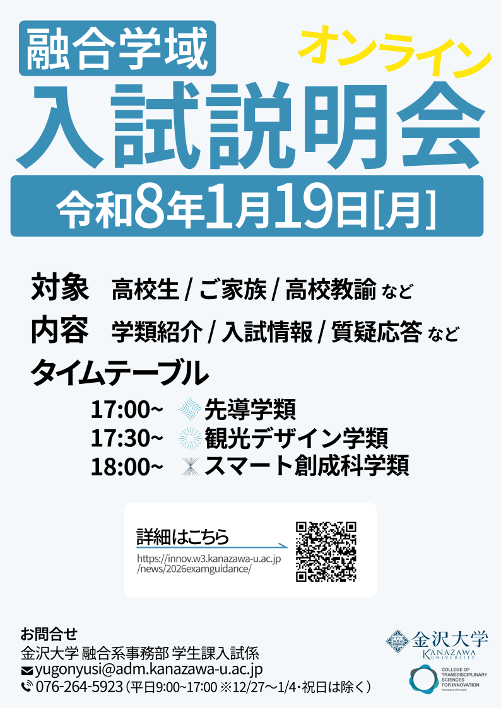

[【１/１９（月）開催！】融合学域 各学類 オンライン入試説明会](<https://innov.w3.kanazawa-u.ac.jp/news/2026examguidance/>)

## 目的

例年1月に開催される融合学域オンライン入試説明会の参加者数を増やす。

## 担当範囲

融合学域の広報担当者と協業。同イベントの過去のチラシの問題点を共有し、デザインを改善する方針で制作。例年のチラシは印刷することを前提に作られていたが、スマートフォンやPCで多く閲覧されることが期待されたため、表示媒体に合わせたものを作成することを提案。

## 条件

- 期間：2025年11〜12月頃
- 媒体：公式サイトニュース記事サムネイル
- 使用ツール：Inkscape（サムネイルの作成に使用）

## こだわり

説明会へ参加するまでの導線も提案。具体的には、QRコードからどこに飛べるようにするべきか、飛んだ先でどのような誘導をして、オンライン入試説明会のリンクをどこに配置するべきかを広報担当者、関係者と一緒に検討。

