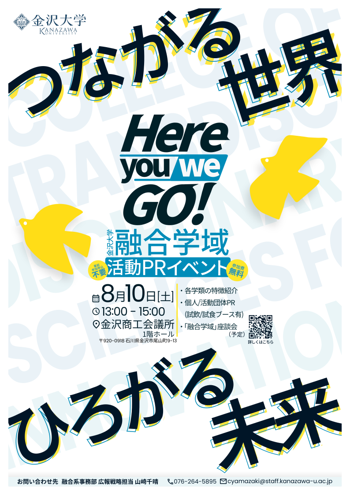
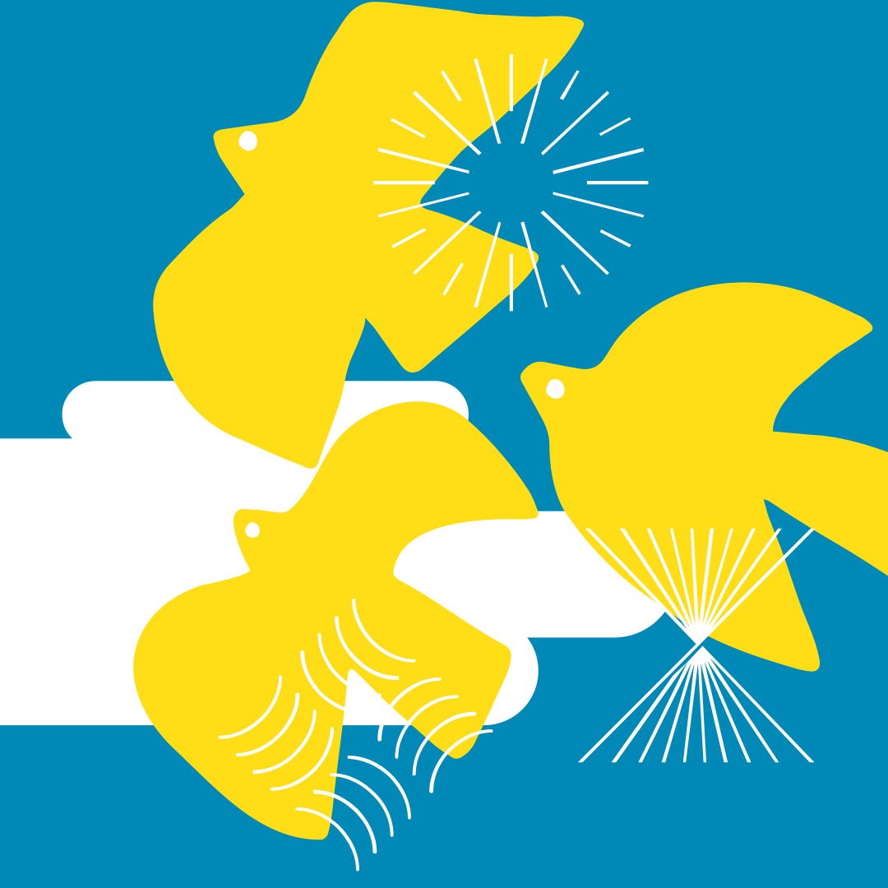
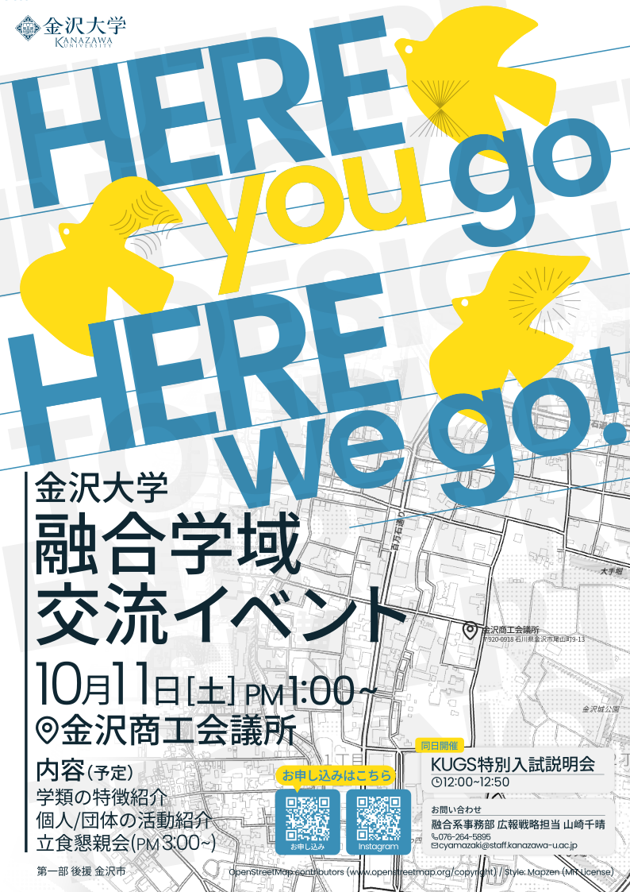
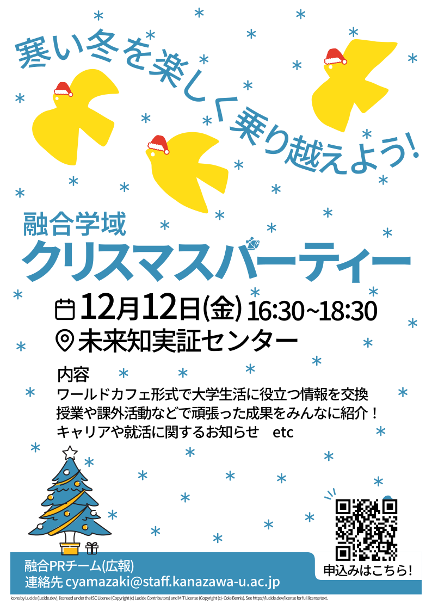

## グラフィックデザイン

### 融合学域交流イベント「Here, you go / Here, we go.」（2024年度）宣伝チラシ/ポスター

[融合学域PRイベント「Here, You Go / Here, We Go」を開催！](https://innov.w3.kanazawa-u.ac.jp/news/news-2640/)

#### 目的

2024年度に初めて行われたこのイベントを学内のみならず、広く地域に知らせる。

#### 担当範囲

融合学域の広報担当者と、イベントの学生ボランティアとしてプロジェクトに参加。情報の整理、チラシ（ポスター）の作成を担当。キャッチコピー「つながる世界　ひろがる未来」は先輩学生ボランティアが考案。

広報担当者から、イメージとしての参考資料とチラシ（ポスター）の役割（周知/集客など）を共有。配色やレイアウトなど見た目に関するものは融合学域のパンフレットのデザインを参考に自分から提案した。

#### 条件

- 期間：2024年6〜8月頃
- 媒体：A4チラシ/B0ポスター
- 制約：一般業務用複合機での印刷
- 使用ツール：Inkscape（チラシ（ポスター）の作成に使用）

#### こだわり

融合学域でデザインをするきっかけとなった最初の一枚。

従来のデザインによって形成された融合らしさを壊さないように、配色やテキストのレイアウトなどに気をつけた。

また、周りの色と色の相互作用による認知上の色の違いを吸収するように、つまり周りの色に影響も考慮して印象として色が同じように感じられるように色を微妙に調整。

融合の楽しさ、ワクワクを表現することを意識しながらあしらいを付けた。

---

### 融合学域公式Instagramアイコン

[【公式】金沢大学融合学域](https://www.instagram.com/kanazawa.u_yugo/)

#### 目的

融合学域の知名度向上、広報力強化のために再出発した融合学域公式Instagramの顔を作る。

#### 担当範囲

融合学域PRチームにデザイン監修として参加。Instagramのアイコンを作成。

#### 条件

- 期間：2024年12月頃
- 媒体：Instagramアイコン
- 使用ツール：Inkscape（アイコンの作成に使用）

#### こだわり

ひと目見て融合学域だとわかるような見た目を意識。融合の配色と鳥、各学類のアイコンを組み合わせた。鳥が空を飛んでいるように見せるために、背景に雲を追加。実際の見た目で全体が調和するように、随時丸く切り抜いて確認しながら作成した。

---

### 融合学域交流イベント「Here, you go / Here, we go.」（2025年度）宣伝チラシ/ポスター

[融合学域交流イベント「Here, You Go / Here, We Go」を１０月に開催！](https://innov.w3.kanazawa-u.ac.jp/news/hereyougo/)

#### 目的

このイベントを学内のみならず、広く地域に知らせる。

#### 担当範囲

融合学域の広報担当者と、イベントの学生ボランティアとしてプロジェクトに参加。情報の整理、チラシ（ポスター）の作成を担当。

広報担当者から、昨年度の同イベントのチラシを全体的なデザインはそのまま、文言を大きくすることと内容を修正する方針を受け、全体的なデザインの方向性は維持しつつより魅力的で情報が伝わるように改善。

#### 条件

- 期間：2025年6〜10月頃
- 媒体：A4チラシ/B0ポスター
- 制約：一般業務用複合機での印刷
- 使用ツール：Inkscape（チラシ（ポスター）の作成に使用）、Git（デザインファイルのバージョン管理）、GitHub（デザインファイルの自動PDFエクスポート、共有）、シェルスクリプト（デザインファイルの自動コミット、自動PDFエクスポート）

#### こだわり

このイベントの2回目も作成させていただいた。

前回のチラシに対して、イベントの5W1Hを伝える部分をもっと大きく強調してほしいというフィードバックをいただき、限られたスペースで情報を極力大きくなるように意識した。

開催場所がわかりやすいように地図の使用に挑戦。単に地図を平面的に配置するだけでなく、前面の鳥が空を飛んでいるよう見せるため、地図を地上に見立てて奥行きを意識して作成。

背景の文字が全体に馴染むように、合成モードを利用して重ねた。地図の使用も相まって、紙面全体の情報量が増えて昨年度のものより賑やかな印象に仕上げることができた。

---

### 融合学域クリスマスパーティー（2025年度）チラシ/公式サイトニュース記事サムネイル

[融合学域クリスマスパーティを開催！](https://innov.w3.kanazawa-u.ac.jp/news/news-3817/)

#### 目的

融合学域の学生や教員の交流会としてクリスマスパーティーを開催。多くの学生に参加してもらうために、このチラシを作成。

#### 担当範囲

融合学域PRチームのデザイン担当としてチラシを作成。キャッチコピーはチームで考案。

#### 条件

- 期間：2025年11〜12月頃
- 媒体：A4チラシ/公式HPニュース記事サムネイル
- 制約：一般業務用複合機での印刷
- 使用ツール：Inkscape（チラシ（ポスター）の作成に使用）

#### こだわり

融合らしさを壊さないようにしつつ、クリスマスであることを印象付けることを意識して作りました。全体に雪を散らしたり、融合の鳥さんにクリスマス帽を被せたり、クリスマスツリーを配置したりしました。遊び心を持たせるために、QRコードに雪を積もらせました。

---

### 融合学域オンライン入試説明会（2025年度）

[【１/１９（月）開催！】融合学域 各学類 オンライン入試説明会](<https://innov.w3.kanazawa-u.ac.jp/news/2026examguidance/>)

#### 目的

例年1月に開催される融合学域オンライン入試説明会の参加者数を増やす。

#### 担当範囲

融合学域の広報担当者と協業。同イベントの過去のチラシの問題点を共有し、デザインを改善する方針で制作。例年のチラシは印刷することを前提に作られていたが、スマートフォンやPCで多く閲覧されることが期待されたため、表示媒体に合わせたものを作成することを提案。

#### 条件

- 期間：2025年11〜12月頃
- 媒体：公式サイトニュース記事サムネイル
- 使用ツール：Inkscape（サムネイルの作成に使用）

#### こだわり

説明会へ参加するまでの導線も提案。具体的には、QRコードからどこに飛べるようにするべきか、飛んだ先でどのような誘導をして、オンライン入試説明会のリンクをどこに配置するべきかを広報担当者、関係者と一緒に検討。

